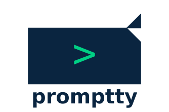

<p align="center">
  
</p>

A bridge application that connects Slack and MS Teams with terminal-based LLM interfaces (Claude Code) running locally.

Built with [Bun](https://bun.sh) for fast startup and native TypeScript + SQLite support.

## Features

- **Slack & Teams Support** - Works with both platforms simultaneously
- **Acknowledgement + Response** - Immediate feedback when processing starts
- **Platform-Appropriate Formatting** - mrkdwn for Slack, Adaptive Cards for Teams
- **Per-Channel Configuration** - Map channels to specific working directories
- **Session Persistence** - Maintains conversation context with `--resume` support
- **Intermediate Callbacks** - LLM can send updates during long-running tasks via MCP

## Architecture

```
Slack/Teams → Promptty Bridge → Local Process (Claude Code)
                   ↑                     |
                   └─── IPC/stdout ──────┘
```

## Quick Start

### 1. Install Bun

```bash
curl -fsSL https://bun.sh/install | bash
```

### 2. Install Dependencies

```bash
cd /Users/casey/git/promptty
bun install

# Also install MCP server dependencies
cd mcp-server && bun install && cd ..
```

### 3. Configure Environment

Copy `.env.example` to `.env` and fill in your credentials:

```bash
cp .env.example .env
```

**For Slack:**
1. Create a Slack app at https://api.slack.com/apps using `slack-app-manifest.json`
   - Click "Create New App" → "From an app manifest"
   - Select workspace and paste the manifest
2. Create an App-Level Token: Basic Information → App-Level Tokens → Generate (scope: `connections:write`)
3. Install to workspace: Install App → Install to Workspace
4. Copy tokens to `.env`:
   - `SLACK_APP_TOKEN` - App-Level Token (xapp-...)
   - `SLACK_BOT_TOKEN` - Bot User OAuth Token (xoxb-...)
   - `SLACK_SIGNING_SECRET` - Signing Secret from Basic Information

**For Teams:**
1. Register a bot at https://dev.botframework.com
2. Get App ID and Password
3. Configure messaging endpoint: `https://your-server/api/messages`

### 4. Configure Channels

Edit `config.json` to map channels to working directories:

```json
{
  "channels": {
    "slack:T0123456789/C0123456789": {
      "workingDirectory": "/path/to/your/project",
      "command": "claude",
      "sessionTTL": 14400000
    }
  },
  "defaults": {
    "command": "claude",
    "sessionTTL": 14400000
  }
}
```

**Finding Channel IDs:**
- Slack: Right-click channel → "View channel details" → Copy Channel ID
- Teams: Use Graph API or check URL in web Teams

### 5. Run

```bash
# Development (with hot reload)
bun dev

# Production
bun start
```

## Configuration

### Environment Variables

| Variable | Description | Required |
|----------|-------------|----------|
| `SLACK_APP_TOKEN` | Slack app-level token (xapp-...) | For Slack |
| `SLACK_BOT_TOKEN` | Slack bot token (xoxb-...) | For Slack |
| `SLACK_SIGNING_SECRET` | Slack signing secret | For Slack |
| `TEAMS_APP_ID` | Teams bot app ID | For Teams |
| `TEAMS_APP_PASSWORD` | Teams bot password | For Teams |
| `LOG_LEVEL` | Log level (trace/debug/info/warn/error) | No (default: info) |
| `DATA_DIR` | Directory for SQLite database | No (default: ./data) |
| `CONFIG_PATH` | Path to config.json | No (default: ./config.json) |
| `CALLBACK_PORT` | Port for callback server | No (default: 3001) |

### Channel Configuration

Each channel entry in `config.json`:

```json
{
  "workingDirectory": "/path/to/project",
  "command": "claude",
  "systemPrompt": "You are helping with...",
  "sessionTTL": 14400000,
  "allowedTools": ["Bash", "Read", "Write"]
}
```

## MCP Tools (Chat Integration)

Claude Code can send messages back to chat channels and post progress updates using the Promptty MCP server.

### Available MCP Tools

- **`mcp__promptty__post_update`** - Send progress updates to the current conversation thread
- **`mcp__promptty__send_message`** - Send messages to any configured channel
- **`mcp__promptty__list_channels`** - List available channels

### Setting Up MCP Server

**CRITICAL: The `workingDirectory` in your config.json MUST be the directory containing the `.mcp.json` file.** Claude Code discovers MCP servers from the working directory's `.mcp.json`.

1. **Install MCP server in your project's working directory:**
   ```bash
   bun run src/cli/index.ts mcp install /path/to/your/project
   ```

   This creates `.mcp.json` in your project directory and enables MCP servers in Claude settings.

2. **Verify your config.json workingDirectory matches:**
   ```json
   {
     "defaults": {
       "workingDirectory": "/path/to/your/project"
     }
   }
   ```

   If `workingDirectory` points to a different directory than where `.mcp.json` lives, **MCP tools will not be available**.

3. **Check MCP status:**
   ```bash
   bun run src/cli/index.ts mcp status /path/to/your/project
   ```

### MCP Configuration Files

The `mcp install` command creates:

**`.mcp.json`** (in your project directory):
```json
{
  "mcpServers": {
    "promptty": {
      "command": "bun",
      "args": ["run", "/path/to/promptty/mcp-server/index.ts"],
      "env": {
        "PROMPTTY_CALLBACK_URL": "http://127.0.0.1:3001"
      }
    }
  }
}
```

**`.claude/settings.local.json`** (enables project MCP servers):
```json
{
  "enableAllProjectMcpServers": true
}
```

### Troubleshooting MCP Tools

**"MCP tools aren't available"**
1. Verify `workingDirectory` in config.json matches where `.mcp.json` is located
2. Check `.claude/settings.local.json` has `"enableAllProjectMcpServers": true`
3. Run `claude mcp list` from your project directory to verify the promptty server connects

**"No session ID available"**
- This is an internal error. The `PROMPTTY_SESSION_ID` env var is automatically set by Promptty when invoking Claude Code.

**Callbacks not reaching chat**
1. Verify callback server is running on the configured port (default 3001)
2. Check `PROMPTTY_CALLBACK_URL` in `.mcp.json` matches the callback server port
3. Look for callback logs: `LOG_LEVEL=debug bun start`

### Using MCP Tools in Claude Code

Once configured, Claude Code can:

```
# Post progress update to current thread
mcp__promptty__post_update(message="Analyzing files...", type="progress")

# List available channels
mcp__promptty__list_channels()

# Send to a specific channel
mcp__promptty__send_message(platform="slack", channel_id="C0123456789", message="Hello!")
```

Update types: `progress`, `warning`, `success`, `error`

## Session Persistence

Promptty maintains conversation context:

1. **Thread-based**: Messages in the same thread share a session
2. **Resume support**: Uses Claude Code's `--resume` flag
3. **Auto-expiry**: Sessions expire after TTL (default 4 hours)
4. **SQLite storage**: Persisted to `data/promptty.db`

## Project Structure

```
promptty/
├── src/
│   ├── index.ts              # Entry point
│   ├── config/               # Configuration loading
│   ├── db/                   # Bun SQLite session storage
│   ├── llm/                  # Claude Code executor
│   ├── platforms/            # Slack & Teams adapters
│   ├── callbacks/            # Callback HTTP server
│   ├── formatters/           # Response formatting
│   └── utils/                # Logging
├── mcp-server/               # MCP server for callbacks
├── skills/                   # Claude Code skills
├── config.json               # Channel configuration
└── data/                     # SQLite database
```

## Development

```bash
# Run in watch mode
bun dev

# Type checking (optional, Bun runs TS directly)
bun run typecheck
```

## Troubleshooting

### Slack not receiving messages

1. Check Socket Mode is enabled in Slack app settings
2. Verify bot has been added to the channel
3. Check token scopes include `channels:history` and `im:history`

### Teams not receiving messages

1. Verify bot is registered and credentials are correct
2. Check the messaging endpoint is accessible
3. Ensure bot is added to the team/channel

### Claude Code not found

Ensure `claude` is in your PATH:
```bash
which claude
```

### Session not persisting

1. Check working directory is writable
2. Verify thread_ts is being captured correctly
3. Check logs for session creation messages

## License

MIT
